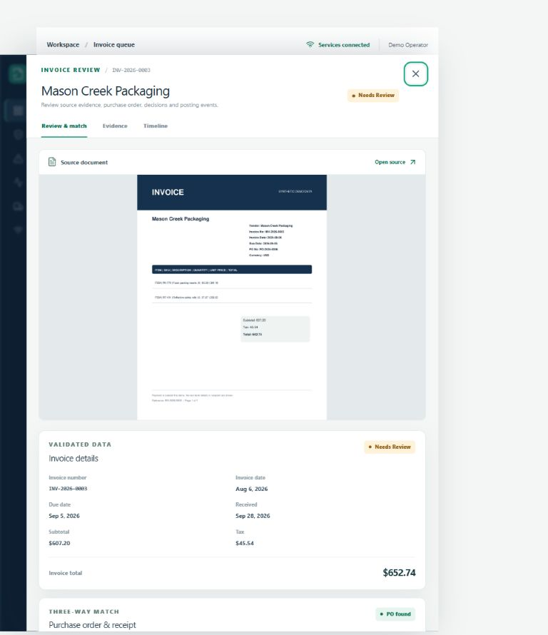
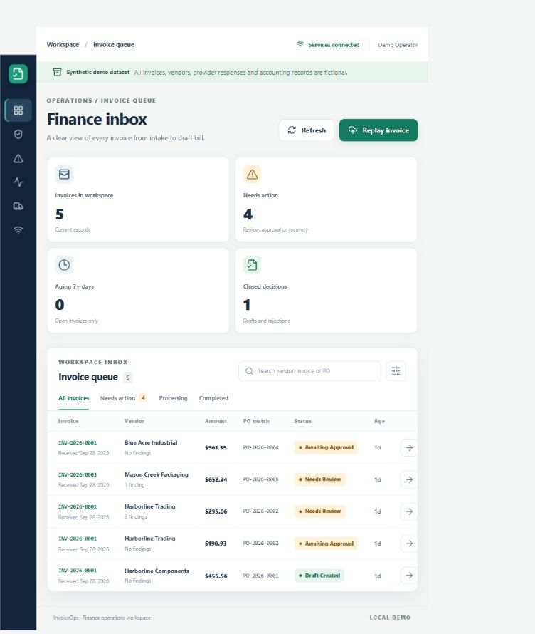
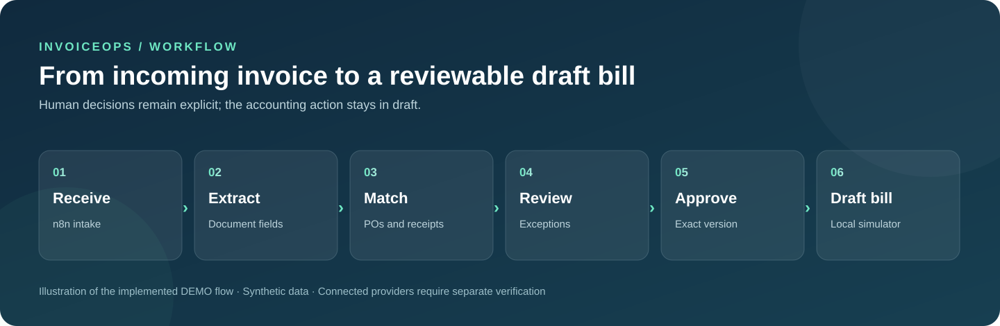

# InvoiceOps

> A reviewable accounts-payable workflow coordinated by n8n.



*Actual portal capture from the locally running DEMO on 2026-09-29. Invoice, vendor, PO, and receipt data are synthetic.*

[Getting started](#getting-started) · [Architecture](docs/ARCHITECTURE.md) · [Evaluation](docs/EVALUATION.md) · [Security](docs/SECURITY.md)

## Overview

An independent, self-hosted accounts-payable pilot for a fictional small distributor. It receives invoice PDFs through n8n, extracts document fields in an asynchronous FastAPI/LangGraph worker, compares them with purchase orders and receipts, asks the right person to approve the exact version, and creates a **draft** bill in a local accounting simulator. PostgreSQL stores business state; a React portal presents the review and exception workflow. The connected Xero, IMAP, and Google Drive workflows are included but inactive until customer-owned credentials and mappings are configured.

Current implementation and test evidence are in [docs/IMPLEMENTATION_STATUS.md](docs/IMPLEMENTATION_STATUS.md); this is a DEMO pilot, not a claim of production deployment or live-provider accuracy.

### Core workflow

**Invoice intake → extraction → PO match → approval → draft bill → archive**



*Finance inbox in the same local DEMO. The screenshot illustrates the UI and seeded workflow states; it is not a live accounting integration.*



*Workflow illustration; the two images above are actual portal captures.*

### Capabilities

- Async document processing and exception routing
- Exact-version approval and durable posting ledger
- Local accounting simulator with connected adapters

### Technology

n8n · FastAPI · React · LangGraph · PostgreSQL

### Evidence and scope

The local Compose demo exercised an n8n webhook through one simulated draft and archive, duplicate suppression and exception routing. Live Xero behavior remains unverified. The included demo uses synthetic data and local simulators. Deployment and live-provider limits are documented in [implementation status](docs/IMPLEMENTATION_STATUS.md).

## Getting started

Run the local demonstration from the repository root using the project-specific instructions below. External service credentials are needed only for connected integrations.

### Start the local demo

Requirements: Docker Desktop or another Docker Compose daemon; Python 3.12 with the project dependencies for local bootstrap. From this directory on Windows:

```powershell
powershell -ExecutionPolicy Bypass -File .\scripts\demo-up.ps1
.venv\Scripts\python.exe scripts\setup_local_n8n_owner.py
.venv\Scripts\python.exe scripts\bootstrap_workflows.py import --activate-demo
.venv\Scripts\python.exe scripts\replay_events.py --event-id event-0001
```

Run `uv sync --frozen` first if `.venv` is absent. On POSIX, use `sh scripts/demo-up.sh` and `.venv/bin/python` in place of the Windows commands. The first command creates a local `.env` with random secrets if absent, builds the images, generates the fast synthetic corpus, applies migrations, and seeds demo accounts. The owner helper initializes n8n only on a loopback DEMO instance and stores its random password in ignored `.env`. The workflow import installs 18 exports inactive, then publishes only the 14 DEMO workflows. Replay sends a generated PDF through the actual n8n webhook.

Default loopback URLs are `http://127.0.0.1:8080` for the portal and `http://127.0.0.1:5678` for n8n. Set `WEB_HOST_PORT` and `N8N_HOST_PORT` in `.env` when those ports are occupied; the startup script prints the effective URLs. For the seeded portal accounts and recovery instructions, use [docs/HANDOVER.md](docs/HANDOVER.md) and [docs/OPERATIONS.md](docs/OPERATIONS.md). Keep `.env` out of version control.

## Project map

| Path | Purpose |
| --- | --- |
| [apps/api](apps/api) | API, worker, validation, approval and accounting operation contracts. |
| [apps/web](apps/web) | React finance inbox and review UI. |
| [workflows](workflows) | Exported n8n workflow pack and manifest. |
| [migrations](migrations) | PostgreSQL business schema migration. |
| [scripts](scripts) | Bootstrap, fixture generation, replay, local mail demonstration and setup. |
| [evals](evals) | Isolated scenario inputs and offline evaluation runner. |
| [docs](docs) | Architecture, API, security, data card, evaluation, operations, commercialization and handover. |

The fixed-seed full corpus generates 240 invoices from 18 vendors and eight layouts, 100 POs, 160 receipts, 400 intake events and 60 exceptions. On the 67 supported held-out **synthetic** documents, the DEMO visible-text/OCR parser matched 601/603 material headers (99.6683% precision and recall); scanned documents matched 115/117. Actual n8n runs have reached one simulated draft and archive, suppressed an exact redelivery, and routed distinct-file duplicate identity and price mismatch to review. See [docs/EVALUATION.md](docs/EVALUATION.md) for the protocol, denominators and limits. Timeout reconciliation, live model and Xero remain unverified on authorized test accounts.

