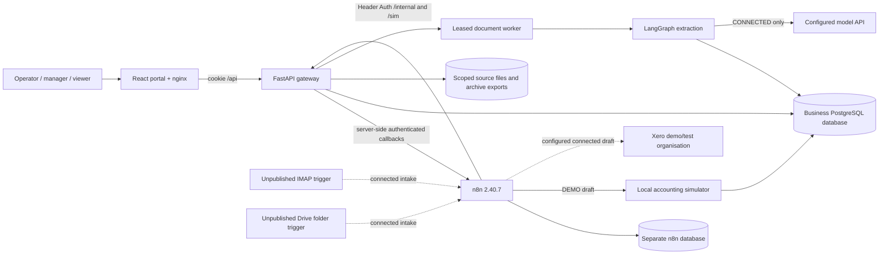
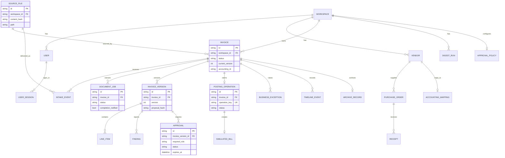

# Architecture

## Runtime boundaries

`compose.yaml` starts PostgreSQL, the fast corpus generator, the API, n8n, and the web proxy. PostgreSQL contains a business database and a distinct n8n database. The API process starts its leased extraction worker; jobs and LangGraph checkpoints survive process restarts. n8n's generated workflows and stable IDs are in `workflows/`, with the generator and bootstrap under `scripts/`.

## Business flow

1. A server-owned webhook event passes n8n Header Auth and reaches `/internal/intake`. `IntakeEvent` deduplicates the source identity; `SourceFile` deduplicates bytes per workspace.
2. n8n starts `/internal/jobs`. The worker leases a job, verifies the source hash, extracts fields, and commits a typed result. It sends an authenticated completion callback. A schedule lists unacknowledged completed/failed jobs if the callback is lost.
3. n8n calls `/internal/invoices/{id}/validate`; the API creates an immutable `InvoiceVersion`, line items, findings, and a computed route. n8n branches to `/route`, which rechecks version and route before creating exceptions or approvals.
4. A portal decision commits first. A callback asks n8n to claim a posting operation; a schedule recovers lost callbacks. The API checks current version, proposal hash, required roles, expiry, blocking findings, duplicate identity, and accounting mapping under a lock.
5. n8n sends the claimed operation to the simulator in DEMO, records accepted/declined/uncertain status, and calls the idempotent archive endpoint after an accepted result. For an uncertain simulator response, reconciliation queries by immutable operation key before recording a result.

The callback is a wake-up signal, not an authorization grant. Every sensitive transition is rechecked against stored state. The posting ledger has one operation per invoice and a unique operation key. See [ADR-002](ADR-002-durable-approval-and-posting.md).

## Core data model

The diagram focuses on operational relationships; [models.py](../apps/api/invoiceops/models.py) defines exact columns and constraints. In particular, source bytes are unique by `(workspace_id, content_hash)`, intake identities by `(workspace_id, source_id)`, approvals by `(invoice_version_id, required_role)`, and posting by invoice and operation key.

## Failure boundaries

- A completed document job is acknowledged only after its route or failure is persisted. Lost callbacks are recovered from `/internal/jobs/pending-completions`.
- Approval and exception-resolution callbacks are best effort; n8n schedules query `/internal/recovery/pending-postings` and `/internal/recovery/pending-routes`.
- An ambiguous bill response sets `uncertain`; simulator reconciliation queries by operation key. A lookup error leaves it uncertain. A negative lookup becomes an operator-visible failure before any retry.
- The shared n8n Error Trigger logs workflow and execution IDs. It cannot always derive an invoice ID, so some failures are log-only rather than rows in the business exception queue.
- A committed `claimed` posting operation with no recorded provider result enters the uncertain reconciliation list after four minutes; provider lookup precedes any retry. Connected-provider retry still requires its own verified absence, safe new idempotency key, and operator review.
